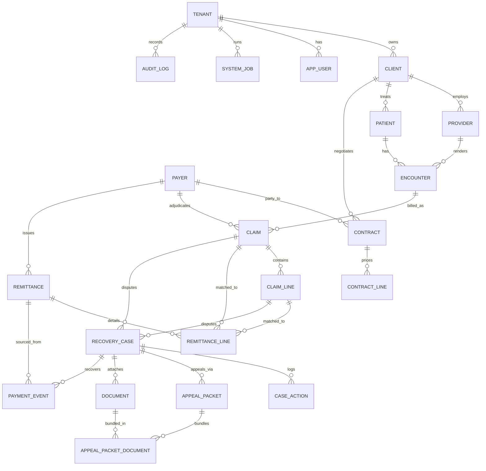

# RCM Recovery Platform — Data Architecture

PostgreSQL (14+) schema for a multi-tenant healthcare RCM underpayment and
denial recovery platform. Data layer only — no UI, no application code.

## Layout

```
db/
├── migrate.sh                # ordered migration runner (tracks schema_migrations)
└── migrations/
    ├── 0001_extensions_and_helpers.sql   # extensions, enums, session-context + trigger functions
    ├── 0002_tenancy_and_users.sql        # tenant, client, app_user
    ├── 0003_payers_providers_contracts.sql
    ├── 0004_patients_encounters.sql
    ├── 0005_claims_remittances.sql
    ├── 0006_recovery_workflow.sql        # recovery_case, case_action, appeal_packet(+docs), document, payment_event
    ├── 0007_audit_and_jobs.sql           # audit_log + generic audit trigger, system_job
    ├── 0008_rls_triggers_grants.sql      # RLS policies, updated_at triggers, roles/grants
    ├── 0009_detection_engine_support.sql # remit matching hints, case scoring fields,
    │                                     #   medicare_fee_schedule, client_payer_config
    ├── 0010_appeals_and_ingest.sql       # appeal_packet routing flags, corrected_claim,
    │                                     #   client address + review threshold
    ├── 0011_web_interface.sql            # app_user.password_hash, activity-feed index
    ├── 0012_automation_notifications.sql # notification/-preference, email_outbox,
    │                                     #   automation_rule + rule_execution,
    │                                     #   dashboard_snapshot, client schedule config
    ├── 0013_enterprise_admin.sql         # security policy (lockout/MFA/rotation), SSO,
    │                                     #   integrations, onboarding, exports, invoices,
    │                                     #   immutable audit_log, PHI access logging
    ├── 0014_integration_api.sql          # api_key, api_request_log, outbound_delivery
    ├── 0015_sftp_inbound.sql             # per-client inbound SFTP credentials
    ├── 0016_tenant_rls_fix.sql           # tenant-scoping corrections
    ├── 0017_pretenant_lookup_functions.sql  # pre-tenant lookups via SECURITY DEFINER
    ├── 0018_payer_shared_insert.sql      # shared/tenant payer write rules
    ├── 0019_runtime_rls_and_delivery.sql # non-superuser runtime roles, rate windows,
    │                                     #   scheduler leases, delivery uniqueness
    ├── 0020_remittance_adjustments.sql   # all CAS adjustments per remit line
    ├── 0021_pilot_contract_governance.sql   # contract draft/active/approval gates
    ├── 0022_reference_data_provenance.sql   # versioned, checksummed CMS/X12 imports
    ├── 0023_reconcile_deliveries_job_type.sql
    ├── 0024_client_payer_readiness.sql   # per-client/payer activation capabilities
    ├── 0025_era_financial_integrity.sql  # PLB provider adjustments, 835 balancing state,
    │                                     #   reversal/adjudication detail, recovery
    │                                     #   attribution columns, client balance policy
    ├── 0026_pricing_cob_and_commercial_terms.sql
                                          # payer payment reduction, contract lesser-of,
                                          #   modifier payment rules, claim payer sequence
                                          #   + prior-payer paid, pricing_plan +
                                          #   invoice_line + issued-invoice immutability,
                                          #   subscription/feature enforcement functions
    └── 0027_usage_ledger_ncci_and_attribution_policy.sql
                                          # append-only usage_event billing ledger,
                                          #   payer bundling-edit source + client NCCI
                                          #   policy, per-client attribution policy
```

The detection engine that consumes this schema lives in [../engine](../engine).

Run with:

```sh
DATABASE_URL=postgres://user@host:5432/rcm ./db/migrate.sh
```

## Entity relationships


```mermaid
erDiagram
    TENANT ||--o{ CLIENT : owns
    TENANT ||--o{ APP_USER : has
    TENANT ||--o{ SYSTEM_JOB : runs
    TENANT ||--o{ AUDIT_LOG : records
    CLIENT ||--o{ PROVIDER : employs
    CLIENT ||--o{ PATIENT : treats
    CLIENT ||--o{ CONTRACT : negotiates
    PAYER  ||--o{ CONTRACT : party_to
    CONTRACT ||--o{ CONTRACT_LINE : prices
    PATIENT ||--o{ ENCOUNTER : has
    PROVIDER ||--o{ ENCOUNTER : renders
    ENCOUNTER ||--o{ CLAIM : billed_as
    PAYER ||--o{ CLAIM : adjudicates
    CLAIM ||--o{ CLAIM_LINE : contains
    PAYER ||--o{ REMITTANCE : issues
    REMITTANCE ||--o{ REMITTANCE_LINE : details
    CLAIM ||--o{ REMITTANCE_LINE : matched_to
    CLAIM_LINE ||--o{ REMITTANCE_LINE : matched_to
    CLAIM ||--o{ RECOVERY_CASE : disputes
    CLAIM_LINE ||--o{ RECOVERY_CASE : disputes
    RECOVERY_CASE ||--o{ CASE_ACTION : logs
    RECOVERY_CASE ||--o{ APPEAL_PACKET : appeals_via
    APPEAL_PACKET ||--o{ APPEAL_PACKET_DOCUMENT : bundles
    DOCUMENT ||--o{ APPEAL_PACKET_DOCUMENT : bundled_in
    RECOVERY_CASE ||--o{ DOCUMENT : attaches
    RECOVERY_CASE ||--o{ PAYMENT_EVENT : recovers
    REMITTANCE ||--o{ PAYMENT_EVENT : sourced_from
```

## Design decisions

### Tenant isolation (defense in depth)

1. **Denormalized `tenant_id` on every tenant-scoped table.** Even deep child
   tables (`claim_line`, `remittance_line`, `case_action`) carry it, so
   isolation never requires a join.
2. **Row-level security, forced.** Every tenant-scoped table has
   `ENABLE + FORCE ROW LEVEL SECURITY` with a policy comparing `tenant_id` to
   the session setting. The application sets, per connection or transaction:
   ```sql
   SET app.current_tenant_id = '<tenant uuid>';
   SET app.current_user_id   = '<user uuid>';
   ```
   A session with no tenant set sees **zero rows**. `FORCE` binds even the
   table owner; only `rcm_service` (BYPASSRLS) skips it.
3. **Composite foreign keys.** Parents expose `UNIQUE (tenant_id, pk)` and
   children reference `(tenant_id, fk)` — the database itself rejects a row
   that points at another tenant's data, independent of RLS. The same pattern
   is applied one level down with `(client_id, fk)` so an encounter can't
   reference another client's patient, a claim can't reference another
   client's encounter, etc.

### Roles

| Role | Purpose | RLS | DELETE |
|---|---|---|---|
| `rcm_app` | application connections | bound | only `appeal_packet_document`; everything else is soft delete |
| `rcm_service` | ingestion (835/837), detection, maintenance jobs | **bypasses** | full |

`BYPASSRLS` requires superuser to create; on managed Postgres (RDS, Cloud SQL,
Supabase) either run 0008 as the master user or replace the bypass with a
per-policy `current_setting('app.is_service', ...)` check.

### Soft delete

Mutable business entities carry `deleted_at timestamptz` (NULL = live). The
app role has no DELETE grant, so hard deletes are impossible from application
code. Unique business keys (client name, MRN, NPI, internal claim number,
contract rates) are **partial unique indexes scoped to live rows**, so a
deleted record's key can be reused.

Deliberately *not* soft-deletable (append-only / immutable ledgers):
`audit_log`, `case_action`, `payment_event`, `remittance`, `remittance_line`,
`system_job`.

### Audit trail

A single generic trigger (`app.write_audit(pk_column)`) is attached to every
business-critical table. It captures `INSERT`/`UPDATE`/`DELETE` with full
before/after row state as JSONB, the acting user (`app.current_user_id()`),
and the client IP. It is `SECURITY DEFINER`; the app role has no direct
INSERT/UPDATE on `audit_log` and RLS defines no UPDATE/DELETE policy on it —
the log is append-only and unforgeable from application code. No-op updates
are skipped.

### Deviations from the spec (with reasons)

| Spec | Implemented as | Why |
|---|---|---|
| `USER` table | `app_user` | `user` is a reserved word in PostgreSQL |
| `APPEAL_PACKET.document_ids` array | `appeal_packet_document` join table | FKs can't be enforced on array elements; enforced FKs were required |
| `AUDIT_LOG.timestamp` | `created_at` | avoids the reserved word; same semantics |
| `PAYER` (no tenant field in spec) | nullable `tenant_id` | `NULL` = shared master payer visible to all tenants; non-null = tenant-specific payer/override. RLS allows reading global rows but writing only your own |
| — | `remittance_line.claim_id / claim_line_id` nullable | 835s land before matching; the `match_claims` job links them later. Partial index `idx_remit_line_unmatched` feeds that job |
| — | `remittance_provider_adjustment` (0025) | PLB moves real money (recoupments, forwarding balances, interest) that never appears on a CLP claim. Without it a check cannot be balanced and a payer takeback is invisible |
| — | `payment_event` attribution columns (0025) | A recovered dollar has to be defensible against the customer's own remittances, so the scope, basis, gross, reversals and recoupments behind each figure are stored, not just the total |
| — | `modifier_payment_rule` (0026) | Modifiers change the percentage payable (51 at 50%, 50 at 150%, 80 at 16%). Pricing every modified line at 100% made it look half underpaid. Shared defaults with tenant/payer overrides, composed multiplicatively in `apply_order` |
| — | `pricing_plan` + `invoice_line` (0026) | Recovery is sold on contingency, so the terms are effective-dated data rather than a code constant, and an invoice names every `payment_event` it charges for. A unique index on `payment_event_id` means a recovery can be billed only once |
| — | `invoice` immutable past `draft` (0026) | A trigger refuses to change the figures on an issued bill or delete it; corrections are a void and reissue. Regenerating a month used to silently rewrite an invoice that had already gone out |
| — | `usage_event` (0027) | Freezing the invoice totals stopped the bill changing; it did not stop the evidence changing. The ledger is written once per billable fact with the figures as they stood, is append-only in the database (only `invoice_id` may ever move), and is what invoices are built from — so an issued bill can be reconstructed after the operational tables have moved on |
| — | `client` attribution policy (0027) | Which post-appeal dollars count as recovery is a commercial term, not an engineering constant: basis, window, floor, unallocated handling and clawback rule are per client, each defaulting to the previous hardcoded behavior |
| — | `payer.bundling_edit_source` + `client.ncci_bundling_policy` (0027) | The CMS NCCI tables have been importable since 0022 and nothing read them. These two say how to read them for this payer and what to do when CMS says a bundle can never be unbundled |

### Other conventions

- **PKs:** `uuid DEFAULT gen_random_uuid()` everywhere except `audit_log`
  (bigint identity — high write volume, index locality matters more).
- **Money:** `numeric(12,2)`; remittance totals `numeric(14,2)`.
- **Enums:** PostgreSQL enum types for closed domains (statuses, types).
  Free-form codes (CPT, ICD-10, CARC/RARC, POS) stay `text` — they're
  externally-governed code sets, not app domains.
- **`updated_at`:** maintained by one shared trigger, auto-attached in 0008 to
  every table having the column.
- **Detection-oriented indexes:** partial indexes for the hot worklists —
  denied/underpaid claims, open cases by priority, cases nearing deadline,
  unmatched remittance lines, queued jobs.
- **Duplicate-case guard:** a partial unique index prevents two active cases
  of the same type on the same claim/claim-line, so `run_detection` re-runs
  are naturally idempotent.
- `encounter.diagnosis_codes` is `text[]` with a GIN index (per spec; ICD
  codes are reference data, not FK targets).
- `contract.fee_schedule_document_id → document` is added in 0006 (document
  doesn't exist yet in 0003).
